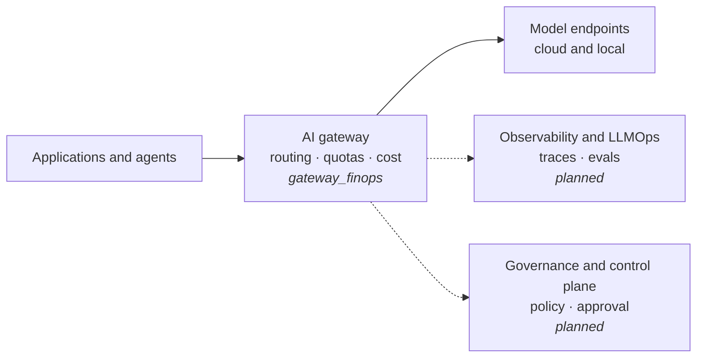

# Enterprise AI Platform Lab

Small, runnable reference implementations of the building blocks of an enterprise AI platform. Each use case lives in its own folder, runs locally, and comes with a README that covers its design and architecture, how to run it, and results from a sample run.

## Use cases

| Use case | What it demonstrates | Stack |
|---|---|---|
| [`gateway_finops`](gateway_finops/) | One LLM gateway in front of two model endpoints: routing, weighted load balancing, fallback, quotas (allowed models, rate limits, budgets) and cost tracking per application | LiteLLM proxy, Postgres, Groq, Ollama, Docker Compose |

More use cases, such as observability and LLMOps, will be added as their own folders.

## Where the use cases sit

## Conventions

- **One folder per use case**, self-contained: its own `README.md`, dependencies and `docker-compose.yml` where needed.
- **Every README covers** the problem, architecture (Mermaid diagrams), design decisions, how to run it, sample results and caveats.
- **No secrets in the repo.** Each use case ships a `.env.example`; real keys come from the environment.
- **Pinned versions** for images and dependencies, so a sample run can be reproduced.
- **A committed sample run** (console output or report) so the results can be read without running anything.
