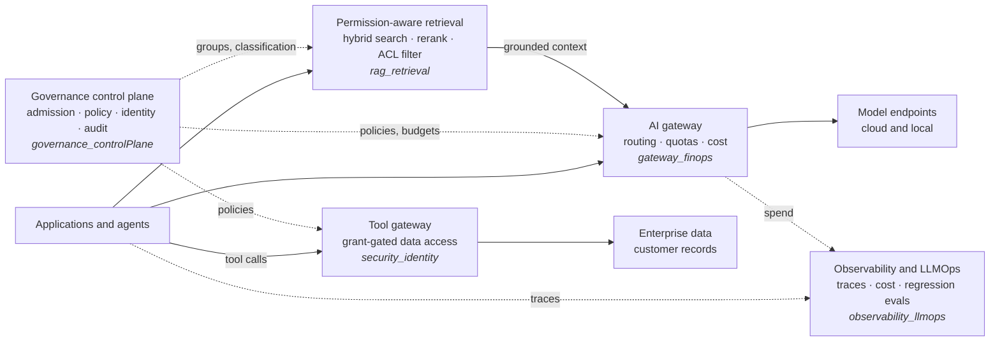

# Enterprise AI Platform Lab

Small, runnable reference implementations of the building blocks of an enterprise AI platform. Each use case lives in its own folder, runs locally, and comes with a README that covers its design and architecture, how to run it, and results from a sample run.

## Use cases

| Use case | What it demonstrates | Stack |
|---|---|---|
| [`gateway_finops`](gateway_finops/) | One LLM gateway in front of two model endpoints: routing, weighted load balancing, fallback, quotas (allowed models, rate limits, budgets) and cost tracking per application | LiteLLM proxy, Postgres, Groq, Ollama, Docker Compose |
| [`observability_llmops`](observability_llmops/) | A LangGraph agent traced with OpenTelemetry (GenAI conventions), token and cost accounting from spans, and a regression-eval gate that fails a run on quality, token or cost regressions | LangGraph, OpenTelemetry, Jaeger, FastAPI, Groq, Ollama |
| [`security_identity`](security_identity/) | A tool-calling agent that must obtain a signed, short-lived grant before reading a customer record; OPA denies unauthorized access at the tool gateway regardless of the agent's instructions (rogue prompts, injection, borrowed grants) | OPA/Rego, RS256 grants, FastAPI, Groq |
| [`governance_controlPlane`](governance_controlPlane/) | A central control plane for agents built by separate business units: admission checks, layered Rego policies, workload identity, model catalog, budgets and a hash-chained audit ledger, enforced by agent, model and tool gateways | OPA/Rego, FastAPI, SPIFFE-style identity, SQLite, Ollama |
| [`rag_retrieval`](rag_retrieval/) | Permission-aware hybrid RAG retrieval: ACLs enforced inside BM25 and vector search, RRF fusion and cross-encoder reranking, evaluated against vector-only search and against post-filtering and no filtering | fastembed (ONNX bge-small, MiniLM cross-encoder), FastAPI, Ollama |

## Where the use cases sit

## Conventions

- **One folder per use case**, self-contained: its own `README.md`, dependencies and `docker-compose.yml` where needed.
- **Every README covers** the problem, architecture (Mermaid diagrams), design decisions, how to run it, sample results and caveats.
- **No secrets in the repo.** Provider keys come from the environment; a use case that needs more configuration ships a `.env.example`.
- **Pinned versions** for images and dependencies, so a sample run can be reproduced.
- **A committed sample run** (console output or report) so the results can be read without running anything.
