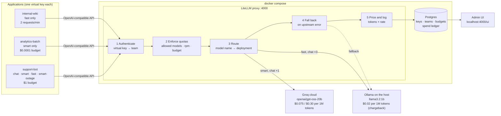
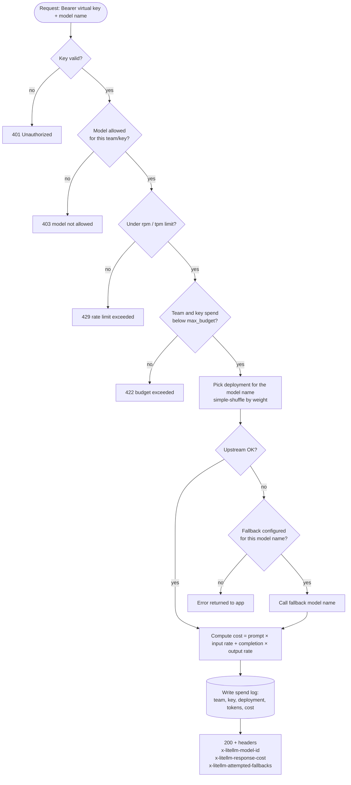
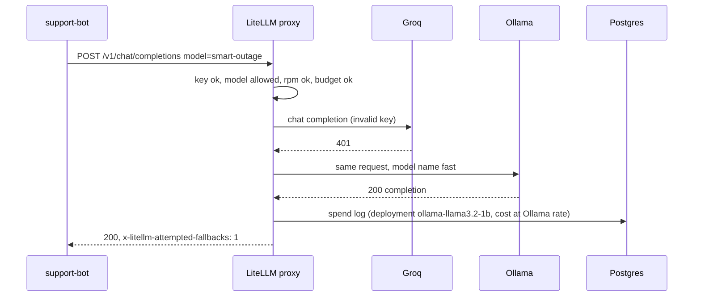

# Gateway FinOps: one LLM gateway, two model endpoints, cost per application

A small, runnable LLM gateway built on [LiteLLM](https://github.com/BerriAI/litellm) (proxy 1.104.2). Three applications call one gateway, which sends them to two model endpoints and demonstrates:

- **Routing**: explicit tiers by model name, plus weighted load balancing across both endpoints
- **Fallback**: a failing upstream is replaced by a second model without the application seeing an error
- **Quotas**: allowed models, requests per minute and dollar budgets, each enforced per application
- **Per-application cost tracking**: every request is priced and written to a ledger, then reported per application and per endpoint

Everything runs locally with Docker Compose. One endpoint is metered (Groq cloud), the other is free (Ollama on the host). The free one carries an internal chargeback rate, so its usage still shows up in the cost report.

## Architecture



| Component | Role | Where it is defined |
|---|---|---|
| LiteLLM proxy | OpenAI-compatible endpoint, key auth, quota checks, router, cost calculation | `docker-compose.yml` (image pinned by digest), `config.yaml` |
| Postgres 16 | Stores virtual keys, teams, budgets and the per-request spend ledger | `docker-compose.yml` |
| Groq | Metered cloud endpoint | `config.yaml`, deployment `groq-gpt-oss-20b` |
| Ollama | Local endpoint on the host, reached through `host.docker.internal:11434` | `config.yaml`, deployment `ollama-llama3.2-1b` |
| `demo.py` | Sets up the three applications, sends traffic, reads the ledger back and writes a CSV | standard library only |
| `dashboard.html` | Static visual report of one run (architecture, flow, timeline, quotas, cost) | open in a browser |

## Request lifecycle

Each stage can end the request early with its own status code. A request rejected by a quota is never sent to a model and costs nothing.



Fallback with a real upstream failure, as it happens in the demo:



## Design

### Applications are teams

Each application is a LiteLLM **team** with one **virtual key**. Quotas sit on the level they belong to:

| Application | Team quota | Key quota | What it exercises |
|---|---|---|---|
| `support-bot` | $1 budget; models `chat`, `smart`, `fast`, `smart-outage` | none | routing, load balancing, fallback |
| `analytics-batch` | $0.0001 budget; model `smart` | none | budget exhaustion on the metered endpoint |
| `internal-wiki` | $1 budget; model `fast` | `rpm_limit: 2` | model allow-list and rate limit |

Putting the budget on the team means every key the application is issued later shares one budget and one cost line. Rate limits sit on the key so that a single noisy client cannot use up the whole team's allowance.

### Model names are the routing contract

Applications ask for a **model name**, never a provider model. The gateway maps names to deployments:

| Model name | Deployments | Purpose |
|---|---|---|
| `smart` | Groq | Explicit premium tier. Falls back to `fast`. |
| `fast` | Ollama | Explicit cheap tier. |
| `chat` | Ollama (weight 3) + Groq (weight 1) | Load balancing that sends most traffic to the cheaper endpoint. |
| `smart-outage` | Groq with an invalid key | Real failing upstream for the fallback demo. Falls back to `fast`. |

Swapping a provider, changing weights or adding a third endpoint is a config change only; the applications don't change.

### Pricing and chargeback

Prices are set explicitly on every deployment (`input_cost_per_token`, `output_cost_per_token`) rather than relying only on LiteLLM's built-in price map:

- **Groq**: $0.075 per 1M input tokens and $0.30 per 1M output tokens. This matches LiteLLM's built-in map for `groq/openai/gpt-oss-20b` in the pinned version.
- **Ollama**: $0.02 per 1M tokens. There is no invoice for a local model, so this is an internal chargeback rate standing in for hardware and power. Without it, local usage would report $0 and look free in the per-application view.

Cost is attributed to the deployment that actually served the request. A request that fell back from Groq to Ollama is billed at Ollama's rate.

### Deterministic behaviour for a demo

- `num_retries: 0`: a failure goes straight to the fallback instead of being retried, so the fallback is visible in a single request.
- A real broken deployment (`smart-outage`) is used instead of LiteLLM's `mock_testing_fallbacks` parameter, which this version disables by default.
- `proxy_batch_write_at: 2` flushes spend to Postgres every 2 seconds, so the report can read it back shortly after the traffic.
- `demo.py` creates new teams and keys on every run (names suffixed with the run time), so each report covers that run only and rate-limit windows from earlier runs don't interfere.
- The LiteLLM image is pinned by digest, not by a moving tag.

## Run it

Prerequisites: Docker, Python 3, a Groq API key, and Ollama running on the host with `llama3.2:1b` pulled.

```bash
ollama pull llama3.2:1b
export GROQ_API_KEY=gsk_...
docker compose up -d                 # gateway on :4000, Postgres for keys and the ledger
python3 demo.py                      # standard library only; prints each section and writes cost_report_<time>.csv
docker compose down -v               # stop and delete the ledger
```

`LITELLM_MASTER_KEY` defaults to `sk-master-demo` (see `.env.example`). Change it for anything beyond a local demo.

## Results from the sample run

Full console output is in [`demo_output.txt`](demo_output.txt); the per-application report is in [`sample_cost_report.csv`](sample_cost_report.csv).

| Capability | Result |
|---|---|
| Explicit routing | `fast` → `ollama-llama3.2-1b`, `smart` → `groq-gpt-oss-20b` |
| Load balancing | `chat`, 20 requests: 13 Ollama, 7 Groq (weights 3:1) |
| Fallback | `smart-outage`: Groq returned 401, Ollama answered, app got 200 with `x-litellm-attempted-fallbacks: 1` |
| Allowed models | `internal-wiki` asking for `smart` → 403 |
| Rate limit | `internal-wiki`, third request in the minute → 429 |
| Budget | `analytics-batch` after spending $0.0001197 against $0.0001 → 422 |

| Application | Served | Blocked | Tokens | Spend (USD) | Budget (USD) |
|---|---:|---:|---:|---:|---:|
| support-bot | 24 | 0 | 1,928 | 0.000200 | 1.00 |
| analytics-batch | 2 | 1 | 516 | 0.000120 | 0.0001 |
| internal-wiki | 2 | 2 | 68 | 0.0000014 | 1.00 |

The spend totalled from the ledger matches the team spend LiteLLM keeps for budget enforcement.

## See it

- **`dashboard.html`**: download and open it in a browser for a visual report of the sample run, with the architecture, traced requests, a timeline of every request, the routing split, quotas and cost per application.
- **LiteLLM Admin UI** at <http://localhost:4000/ui> while the stack is up. Log in as `admin` with the master key. **Usage** shows spend by team, key and model; **Logs** lists every request, including the 403, 429 and 422 rejections; **Teams** and **Virtual Keys** show budget used, limits and allowed models.

## Caveats

- **Budgets are checked before a request runs.** The request that crosses the line still completes, so spend can overshoot by one call ($0.000120 against $0.0001 here). Leave headroom or cap `max_tokens` per key.
- **Rate limits are counted in the gateway process.** With several gateway replicas, add Redis (`router_settings.redis_host`) so the limits are shared.
- **The Ollama rate is an assumption.** Set it from your real hardware and power cost.
- **Provider prices drift.** The Groq rates were correct for the pinned LiteLLM version; check the provider's pricing page before relying on the numbers.

## Taking it further

| Need | Change |
|---|---|
| Secrets | Load provider keys and the master key from a secrets manager instead of the environment |
| Several gateway replicas | Redis for shared rate limits and cooldowns |
| Monthly budgets | `budget_duration: 30d` on teams so spend resets each period |
| Alerts | LiteLLM budget and spend alerts (Slack or webhook) at a percentage of `max_budget` |
| Cost by feature, not just app | Send `metadata.tags` per request and report spend by tag |
| Showback to finance | Export `/spend/logs` to the warehouse on a schedule |

## Files

| File | What it is |
|---|---|
| `docker-compose.yml` | LiteLLM proxy (pinned image) and Postgres |
| `config.yaml` | Model names, deployments, prices, router and fallback settings |
| `demo.py` | Creates the applications, drives traffic, prints the cost report, writes a CSV |
| `demo_output.txt` | Console output of the sample run |
| `sample_cost_report.csv` | Per-application report from the sample run |
| `dashboard.html` | Visual report of the sample run |
| `.env.example` | Environment variables the stack reads |
