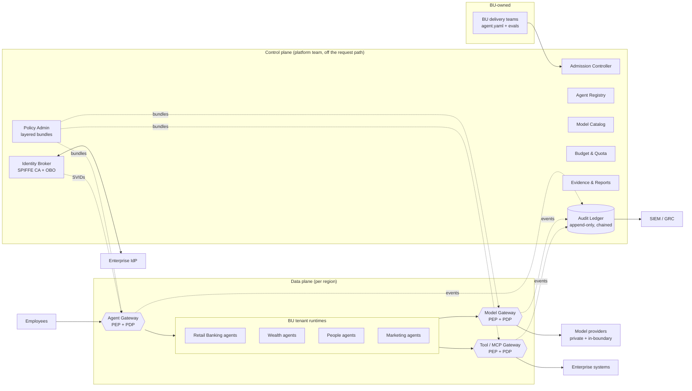
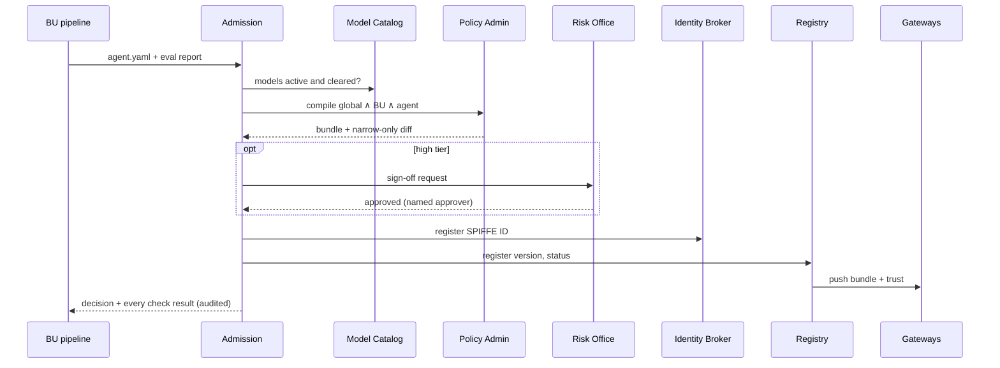
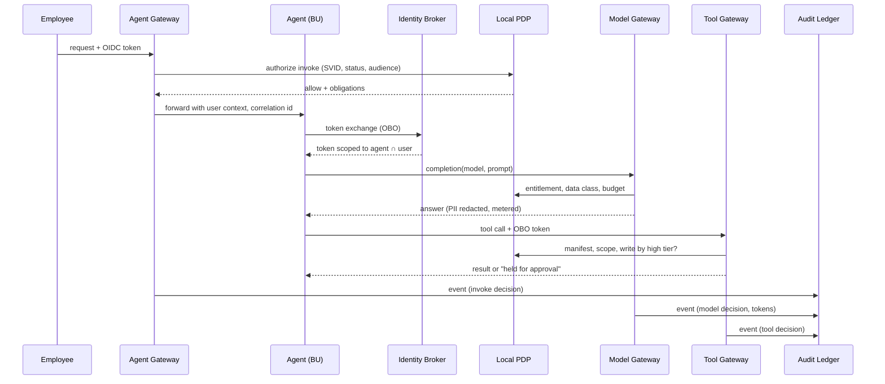

# Governance control plane for federated agents

Business units build, run and release their own agents. A central control plane sets the rules every agent must follow: identity, policy, which models may be used, and audit. Three shared gateways on the network path enforce those rules.

There are two ways to see it:

- **Reference implementation (this folder).** A working control plane, three gateways and a BU agent runtime in Python, with OPA as the policy engine and Ollama answering model calls. Every decision in the UI comes from the Rego policies.
- **Simulation.** Open `index.html` straight from disk (or the published artifact) and the same UI runs a copy of the policy logic in the browser, with no services.

## Run it

Needs Docker, [uv](https://docs.astral.sh/uv/) and, for real model output, Ollama with `llama3.2:1b` pulled (`ollama pull llama3.2:1b`). Without Ollama the model gateway falls back to a mock reply; every policy decision is unchanged.

```bash
docker compose up -d          # OPA on :8181, loads ./policies
uv sync
uv run python run.py          # control plane :8080, gateways :8081, agent runtime :8082 (Ctrl-C to stop)
```

Then, in a second terminal:

```bash
uv run python demo.py         # end-to-end scenarios; exits non-zero if any decision is wrong
```

Open <http://localhost:8080> for the UI. The badge in the header reads **Live · OPA + gateways** when it is talking to the services. `demo_output.txt` holds a full sample run.

Tests:

```bash
uv run pytest -q                                                                           # PII, ledger, decision precedence
docker run --rm -v "$PWD/policies:/policies:ro" openpolicyagent/opa:1.10.1 test /policies -v   # Rego unit tests
uv run python -m cp.reference                                                              # regenerate Rego test data after changing reference.py
```

Stop with Ctrl-C, then `docker compose down`. The registry and ledger start fresh on every run.

### What the demo run shows

| Section | What happens | Evidence in `demo_output.txt` |
|---|---|---|
| Admission | Three manifests go through the A1–A10 Rego checks | Mortgage pre-qualifier admitted with an A4 routing warning; collections agent pending; Opus/legacy agent rejected (HTTP 422) on A2, A3, A4 |
| Separation of duties | A BU admin tries to approve their own high-tier agent | HTTP 403; Risk Office approval succeeds |
| Runtime | Seven requests with real user tokens, SVIDs and on-behalf-of tokens | PII redacted before the model sees it; a Restricted prompt rerouted to the in-boundary model; a refund held as `CASE-1041`; four denials, each naming its rule |
| Kill switch | Retail admin suspends `branch-assist`, then reinstates it | The next call is denied (GR-01), then allowed; Marketing admin gets 403 trying the same |
| Token checks | An unsigned user token; a direct model-gateway call without an SVID | Both refused |
| Audit | Verify, tamper with an event in SQLite, verify again | The break is reported at the tampered event; after the restore the chain is intact; a BU admin sees only their own events |

### The UI

| Tab | What it shows |
|---|---|
| Overview | Architecture diagram (select a component for its role and owner), deploy-time and request-time sequence flows, the platform/BU ownership split |
| Deploy an agent | A BU manifest checked live by the admission controller (A1–A10), the generated `agent.yaml`, and a Deploy button that is disabled while any check fails |
| Registry | Agent inventory with status, tier, identity and bundle; suspend/reinstate (kill switch) and Risk Office approval |
| Policy | Global guardrails, then the global → BU → agent layers and the effective policy, plus the compiled bundle |
| Runtime | One request traced through Agent Gateway → Identity Broker → Model/Tool Gateway → Audit, with the rule ID for every decision. Live mode takes a free-text prompt and shows the model's answer |
| Audit | Hash-chained ledger with chain verification and a tamper demo that shows where the chain breaks |

The **Signed in as** switch changes the persona. A BU admin sees only their own BU's agents and events, can deploy only into their own BU, and cannot approve high-tier agents. In live mode the API enforces the same rules (`X-Persona` header).

## Code layout

| Path | Role |
|---|---|
| `policies/admission.rego` | Deploy-time checks A1–A10, risk scoring, outcome |
| `policies/runtime.rego` | Request-time decisions for the agent, model and tool gateways |
| `policies/identity.rego` | On-behalf-of scopes: agent tools ∩ user's groups |
| `policies/*_test.rego`, `policies/testdata/` | Rego unit tests and the seeded registry they run against |
| `cp/controlplane.py` | Registry, admission API, identity broker (JWKS, JWT-SVIDs, RFC 8693 token exchange), demo IdP, budgets, approvals, audit API, serves the UI |
| `cp/gateway.py` | Agent, model and tool gateways: verify tokens, ask OPA, enforce, write one audit event per hop |
| `cp/agent_runtime.py` | Stands in for the BU tenant runtimes; holds no credentials |
| `cp/ledger.py` | SQLite ledger with SHA-256 chaining and append-only triggers |
| `cp/pii.py` | Pattern-based PII detection and redaction |
| `cp/reference.py` | Catalog, tools, BU policies, users, seed agents, scenarios |
| `run.py`, `demo.py` | Launcher and end-to-end scenario run |

## Architecture



### Components

| Component | Owner | Responsibility |
|---|---|---|
| Admission Controller | Platform | Runs the A1–A10 checks on every deploy and redeploy. A failed check blocks the deploy. |
| Agent Registry | Platform (BU-visible) | Inventory of owner, version, tier, bundle and status. Suspending an agent revokes its SVID. |
| Policy Admin | Platform writes global, BUs write theirs | Compiles global ∧ BU ∧ agent into a signed, versioned bundle per agent. |
| Identity Broker | Platform | SPIFFE workload identity per agent; OAuth 2.0 token exchange (RFC 8693) for on-behalf-of tokens. |
| Model Catalog | Platform | Approved models with hosting, data clearance, chargeback rate, lifecycle status. |
| Budget & Quota | Platform sets caps, BU allocates | Monthly token cap per BU, divided among its agents at admission. |
| Audit Ledger | Platform, read-only to all | Append-only, hash-chained events on write-once storage, streamed to the SIEM. |
| Agent / Model / Tool Gateways | Platform-run, shared | Enforcement points. Each embeds a policy decision point that evaluates pushed bundles locally. |
| BU tenant runtimes | BU | Any framework and release cadence. Egress is closed except through the model and tool gateways. |

## Policy model

Three layers, and each lower layer can only narrow the one above it:

1. **Global guardrails** (platform, cannot be overridden)
   - GR-01 Named owner and workload identity for every agent
   - GR-02 Only active catalog models the BU is entitled to
   - GR-03 Data never goes to a model or tool cleared for a lower classification
   - GR-04 PII redacted before a prompt leaves the boundary
   - GR-05 On-behalf-of: an agent never has more access than its user
   - GR-06 High-risk writes wait for a named human approver
   - GR-07 Spend within the BU allocation
   - GR-08 Every decision audited
   - GR-09 Eval evidence for medium/high tiers; Risk Office sign-off for high
   - GR-10 Agents serve their own BU unless published enterprise-wide
2. **BU policy**: entitled models, data ceiling, approved tools, budget
3. **Agent manifest**: the models, tools, data class and tier this agent needs

At request time the gateway enforces `global ∧ BU ∧ agent ∧ user`. The last term comes from the on-behalf-of token, whose scopes are the agent's declared tools intersected with the user's IdP groups.

The risk tier is derived from the manifest, and the declared tier must be at least the derived one. Scoring: Restricted data +2, Confidential +1, any write tool +1, a write to a Restricted system +1, customer-facing +1. A score of 0 is low, 1–2 is medium, and 3 or more is high.

## Flows

### Deploy-time



### Request-time



## Design decisions

- **Gateways, not SDKs.** Enforcement sits on the network path. A BU cannot skip a check by forgetting a library call, and tenant egress is closed except through the gateways.
- **The control plane is off the hot path.** PDPs evaluate signed bundles locally. If the control plane goes down, new deploys stop but traffic continues. Bundles carry a TTL (300 s in the demo), and a gateway holding an expired bundle fails closed.
- **No static credentials for agents.** Agents hold short-lived SVIDs and on-behalf-of tokens. Provider keys and tool credentials live only in the gateways.
- **Rerouting, not just refusal.** When a prompt's classification exceeds the chosen model's clearance, the model gateway reroutes it to an in-boundary model the agent is entitled to. It denies the call only when no such model exists.
- **Every denial is evidence.** Refusals are audited with their rule ID, so a single correlation ID reconstructs the whole request.
- **BUs keep their autonomy where risk is low.** Low and medium tiers with passing checks deploy without a ticket, and BU admins can suspend their own agents.

## Implementation mapping (production)

| Concern | Suggested building blocks |
|---|---|
| Workload identity | SPIFFE/SPIRE, one SPIFFE ID per agent per BU |
| User identity, OBO | Okta/Entra ID; OAuth 2.0 Token Exchange (RFC 8693) |
| Policy engine | OPA (Rego) or Cedar, bundles signed and served from Policy Admin |
| Gateways | Envoy with `ext_authz` to a sidecar PDP; LiteLLM or similar for the model gateway; an MCP gateway for tools |
| Admission | Kubernetes admission webhook plus a CI check that runs the same rules |
| Ledger | Hash-chained events on object storage with object lock (WORM), streamed to the SIEM |
| Evidence | Eval and red-team reports keyed by agent version |

## Real versus stubbed

Real in this implementation:
- Policy decisions: every admission and runtime decision is evaluated by OPA from the Rego in `policies/`. The control plane pushes the registry, catalog and usage to OPA on every change, and gateways query it locally.
- Tokens: RS256 JWTs. The gateways verify them against the control plane's JWKS. The agent runtime gets a JWT-SVID, then exchanges the user's token for an on-behalf-of token (RFC 8693 form fields) whose `act.sub` must match the SVID.
- PII: detected with patterns and redacted before an external model sees the prompt (the model output shows the prompt as sent). Detected personal data raises the prompt's classification to at least Confidential.
- Models: real calls to Ollama, metered and charged to the BU budget.
- Ledger: SHA-256 chained events in SQLite, with triggers that reject UPDATE and DELETE.

Stubbed:
- **Model identities.** Every catalog model (`claude-*`, `gpt-oss-120b`) is answered by a local stand-in, `llama3.2:1b` by default. Override with `MODEL_STANDIN` or a JSON map in `MODEL_STANDINS`. The response names the stand-in.
- **The IdP.** `/idp/token` issues a user token with no password. In production this is Okta or Entra ID.
- **SPIFFE.** SVIDs are JWT-SVIDs from the control plane, not X.509 SVIDs from SPIRE, and there is no mTLS. Node attestation and the gateway-to-runtime trust are shared demo secrets (`cp/common.py`).
- **Admin sign-in.** Admins are identified by an `X-Persona` header.
- **Enterprise systems.** These are mock functions in the tool gateway. Approval cases are recorded, but nothing executes them.
- **Deployment.** One OPA serves all three gateways, and the three gateways share one process. In production each gateway has its own OPA sidecar and scales on its own.
- **Data.** All state is in memory or a fresh SQLite file per run. Budgets and prices are illustrative.
- **Tampering.** The tamper endpoint exists only to demonstrate detection.
