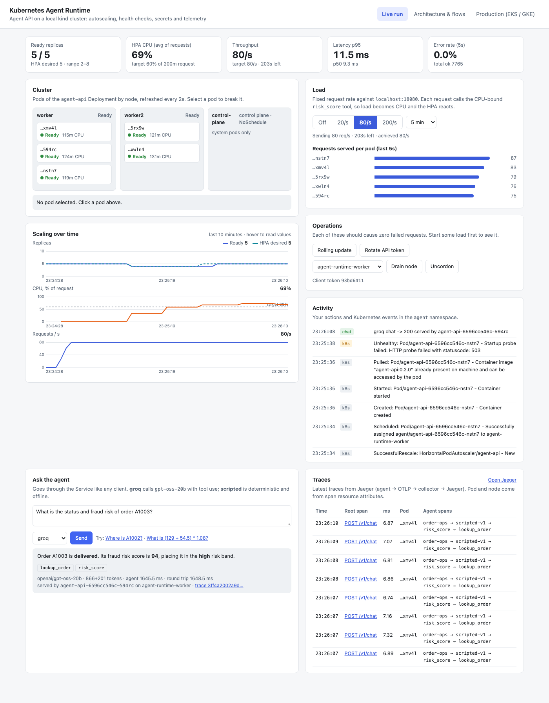
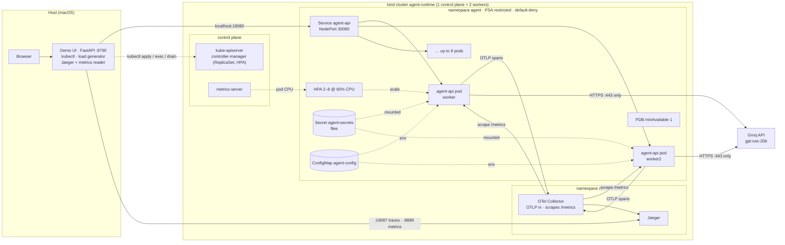
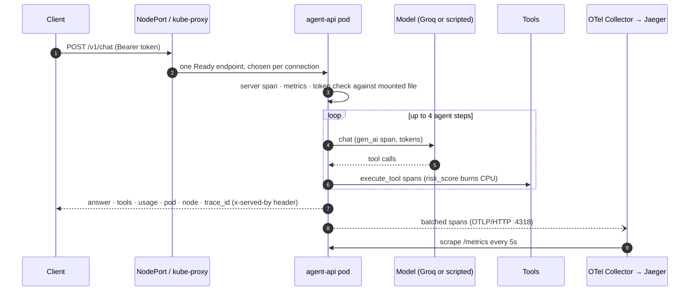
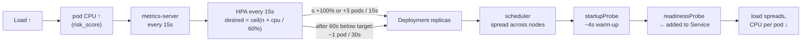
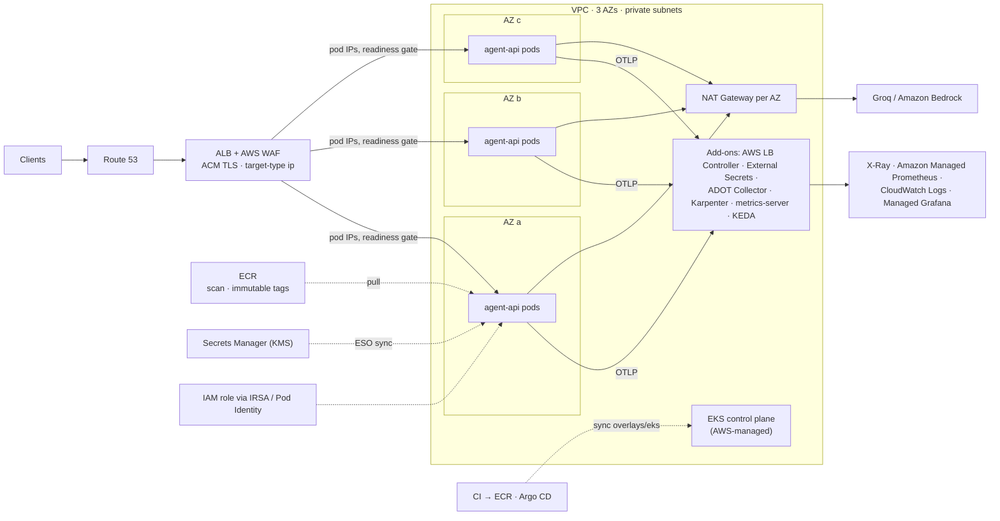
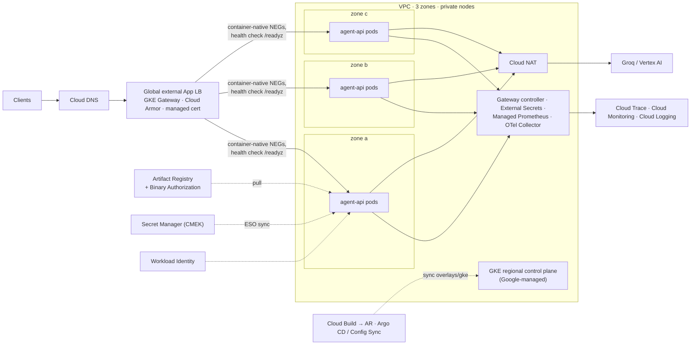

# Agent API on Kubernetes: autoscaling, health checks, secrets and telemetry

A tool-using agent API packaged as a container and deployed to a local three-node [kind](https://kind.sigs.k8s.io/) cluster. The deployment is meant to show production habits at local scale:

- **Autoscaling.** A HorizontalPodAutoscaler scales on CPU from 2 to 8 replicas, with fast scale-out and slow scale-in.
- **Health checks.** Separate startup, readiness and liveness probes. A PodDisruptionBudget and a graceful drain on shutdown.
- **Secrets.** Mounted as files and hot-reloaded, so the API token rotates without restarts and without failed requests.
- **Telemetry.** OpenTelemetry traces go through a collector to Jaeger. Prometheus metrics are scraped from every pod, and logs are JSON with trace ids.
- **Hardening.** Pod Security `restricted`, non-root user, read-only root filesystem, a default-deny NetworkPolicy and no ServiceAccount token.

A demo UI drives the cluster: it applies load, breaks pods, rolls out, rotates the secret, drains a node and shows traces. The same base manifests also ship with **EKS** and **GKE** overlays, and the README draws the equivalent production deployment on each.



## Architecture (local)

The demo UI draws the same architecture: [docs/ui-architecture.png](docs/ui-architecture.png).



| Component | Role | File |
|---|---|---|
| Agent | Order-operations agent with three tools: `lookup_order`, a CPU-bound `risk_score` (PBKDF2, so load turns into CPU), and `calculate`. Two backends: Groq `gpt-oss-20b` with tool calling, and a deterministic `scripted` backend for load tests and CI | `agent_api/agent.py` |
| API | FastAPI with `/v1/chat`, `/v1/info`, the three probes, `/metrics` and a demo-only `/admin/fault` | `agent_api/app.py` |
| Config and secrets | Env from the ConfigMap. Secrets read from mounted files and re-read when they change, with the current token and the previous one both accepted | `agent_api/config.py` |
| Telemetry | OTLP traces with pod, node and namespace attributes. A sampler drops probe and scrape traces. Prometheus RED metrics, tool and token counters, JSON logs carrying `trace_id` | `agent_api/telemetry.py` |
| Image | Two-stage uv build. Runtime is `python:3.12.15-slim`, running as uid 10001 | `Dockerfile` |
| Workload manifests | Namespace, ServiceAccount, Deployment, Service, HPA, PDB, NetworkPolicy, ConfigMap generator | `k8s/base/` |
| Telemetry backend | OTel Collector (OTLP receiver and Kubernetes pod discovery for Prometheus) feeding Jaeger | `k8s/observability/` |
| Cluster add-ons | metrics-server v0.9.0 | `k8s/addons/` |
| Overlays | `local` (kind), `eks`, `gke`, plus a shared `production` component | `k8s/overlays/`, `k8s/components/` |
| Demo UI | Live cluster view, load, chaos, rollout, rotation, drain, chat, traces, plus the architecture and production diagrams | `ui/server.py`, `ui/index.html`, `ui/loadgen.py` |
| Scenario | Runs every operation under load and counts failed requests | `demo.py` → `demo_output.txt` |

## Flows

### A request



### Autoscaling



Scale-out takes about 30–45 s end to end: metrics lag, plus the HPA sync, plus pod start. Scale-in waits 60 s here (300 s in the production component) so a short lull does not make the replica count flap.

### Health checks and self-healing

| Probe or mechanism | Endpoint and timing | On failure |
|---|---|---|
| `startupProbe` | `/startupz` every 2 s, up to 60 s | Other probes wait. The pod is not Ready |
| `readinessProbe` | `/readyz` every 3 s, 2 failures. Checks warm, token mounted, not draining, no fault | Removed from Service endpoints, **not** restarted |
| `livenessProbe` | `/livez` every 5 s, 3 failures. Fails only when the process is wedged | Container restarted by the kubelet |
| ReplicaSet | n/a | A deleted or lost pod is replaced |
| PodDisruptionBudget | `minAvailable: 1` | A drain or upgrade evicts only while capacity remains |
| Shutdown | `preStop: sleep 5` → SIGTERM → uvicorn drains for up to 15 s, within a 30 s grace period | In-flight requests finish. The pod leaves the endpoints before it stops listening |

**A liveness restart can drop a request; a deletion or eviction doesn't.** When a pod is deleted or evicted, Kubernetes first removes it from the endpoints, then `preStop` waits, then the app drains. When liveness fails, the kubelet restarts the container *while the pod is still a Ready endpoint*, so a connection can land on a process that is being killed. The sample run shows it: 3 failed requests out of 1,450 in the liveness phase, and 0 in every other phase. Keep liveness for true deadlocks, with conservative thresholds, and never let it depend on dependencies.

Readiness deliberately **does not check Groq**. If the provider has an outage and readiness depends on it, every replica fails readiness at the same moment and the Service ends up with no endpoints. Instead, upstream errors return 502 on the affected request.

### Secret rotation without restarts

```mermaid
sequenceDiagram
    participant Op as Operator / UI
    participant S as Secret agent-secrets
    participant K as kubelet (each node)
    participant P as agent-api pods
    participant C as Clients
    Op->>S: api-token = NEW, api-token-previous = OLD
    Note over C,P: clients keep sending OLD (still valid everywhere)
    S-->>K: watch
    K->>P: atomic swap of mounted files (~60s, per pod)
    P->>P: mtime changed → reload; accept NEW and OLD
    Op->>P: poll token fingerprint on every pod
    Op->>C: all pods on NEW → switch clients to NEW
```

Secrets are mounted as files rather than env vars for two reasons: env values are fixed at container start, and they show up in `kubectl describe` output and in crash dumps. On EKS and GKE the Secret is written by External Secrets Operator from AWS Secrets Manager or Google Secret Manager, and the pod side of this flow stays the same.

## Production equivalent on EKS or GKE

The same `k8s/base` is used everywhere. `k8s/components/production` adds zone spreading (`DoNotSchedule` across 3 zones), larger requests with no CPU limit, HPA 3–30, a 300 s scale-in window and `maxUnavailable: 1`. Each cloud overlay then sets the image, how traffic gets in, where secrets and identity come from, and where telemetry goes.

The demo UI's **Production** tab draws both clouds ([EKS](docs/ui-production-eks.png), [GKE](docs/ui-production-gke.png)). The same views as Mermaid:

### AWS EKS (`k8s/overlays/eks`)



### Google GKE (`k8s/overlays/gke`)



| Concern | Local (kind) | AWS EKS | Google GKE |
|---|---|---|---|
| Nodes and node scaling | 3 Docker containers | Karpenter NodePools, spot and on-demand | Autopilot or node auto-provisioning |
| Pod scaling | HPA on CPU, 2–8 | HPA 3–30. Add KEDA to scale on queue depth or RPS | Same, or custom metrics from Managed Prometheus |
| Ingress | NodePort → `localhost:18080` | ALB through the AWS LB Controller, `target-type: ip`, ACM, WAF, pod readiness gate | `gke-l7-global-external-managed` Gateway, NEGs, `HealthCheckPolicy` on `/readyz`, Cloud Armor, connection draining |
| Image | `docker build` + `kind load` | ECR, immutable tags, scanning, signing | Artifact Registry, Binary Authorization |
| Secrets | Secret created by `up.sh` from your env | Secrets Manager → `ExternalSecret` | Secret Manager → `ExternalSecret` |
| Workload identity | ServiceAccount with no token | IRSA annotation (or Pod Identity) | Workload Identity annotation |
| Traces, metrics, logs | Collector → Jaeger, collector Prometheus exporter, `kubectl logs` | ADOT → X-Ray and AMP, Fluent Bit → CloudWatch | Collector → Cloud Trace, `PodMonitoring` → Managed Prometheus, Cloud Logging |
| Network policy | kindnet | VPC CNI network policy (or Cilium) | Dataplane V2 |
| Model egress | Direct from the node | NAT Gateway with fixed IPs, or a Bedrock VPC endpoint | Cloud NAT, or Vertex AI over Private Service Connect |

Both overlays render with `kubectl kustomize k8s/overlays/{eks,gke}`. Account ids, ARNs, project ids and hostnames in them are placeholders. They assume the platform already runs the controllers listed in each overlay's header comment.

## Design decisions

- **The HPA owns the replica count.** The Deployment sets no `replicas`, so re-applying the manifests (or a GitOps sync) never resets a scale-out back to one pod.
- **A ConfigMap change rolls the pods.** `configMapGenerator` adds a content hash to the ConfigMap name, so any config change gives the pod template a new reference and triggers a rollout. Without it, a config change would leave the old values in running pods.
- **Rolling updates never reduce capacity.** `maxSurge: 1, maxUnavailable: 0`, combined with `preStop` and readiness, gave zero failed requests out of 3,603 while all 8 pods were replaced under load.
- **CPU limit locally, none in production.** Locally the 1-core limit keeps 8 pods from starving the laptop. In production the component sets only a memory limit, because a CPU limit adds throttling latency without protecting anything.
- **One uvicorn worker per pod.** Kubernetes handles horizontal scaling. Several workers in one pod would hide CPU from the HPA and break the one-process-per-probe assumption.
- **Per-request balancing needs per-request connections.** kube-proxy balances per TCP connection. A keep-alive client stays pinned to the pods that existed when it connected, so pods added by a scale-out get no traffic. The load generator sends `Connection: close`. In production, an ALB or Google load balancer balances each request to pod IPs.
- **Fixed-rate load, not a closed loop.** With N workers in a loop, CPU-bound requests saturate whatever capacity exists and the HPA always goes to max. That happened in calibration: 4 workers took it from 2 to 8 replicas. A fixed arrival rate lets the replica count settle where the load needs it.
- **No probe traces.** Recent FastAPI versions open a server span for every request, probes included. Without the sampler, Jaeger filled with `/readyz` traces. The sampler decides on `url.path`, because FastAPI names the span only after routing.
- **Least privilege.** No ServiceAccount token is mounted. Egress is limited to DNS, the collector and public `:443`. When tested, Jaeger's UI port was unreachable from an agent pod. The namespace enforces Pod Security `restricted`.

## Run it

Requirements: Docker, `kind`, `kubectl`, `uv` (`brew install kind kubectl uv`). Optional: `GROQ_API_KEY` in your environment or `.env` to enable the `groq` backend. Without it, only `scripted` is available.

```bash
./scripts/up.sh                                   # cluster + metrics-server + image + secret + workload + telemetry
uv run --group ui uvicorn ui.server:app --port 8790   # demo UI → http://localhost:8790
uv run --group ui python demo.py                  # scripted scenario (≈15 min) → stdout
uv run pytest                                     # unit tests (no cluster needed)
./scripts/down.sh                                 # delete the cluster
```

`up.sh` is idempotent. It keeps the existing API token unless `API_TOKEN` is set. Endpoints:

| URL | What |
|---|---|
| http://localhost:18080/v1/info | Agent API through the NodePort |
| http://localhost:16687 | Jaeger UI |
| http://localhost:8889/metrics | Collector's Prometheus exporter, with every pod's metrics labelled by `pod` and `node` |
| http://localhost:8790 | Demo UI |

```bash
TOKEN=$(kubectl -n agent get secret agent-secrets -o jsonpath='{.data.api-token}' | base64 -d)
curl -s localhost:18080/v1/chat -H "Authorization: Bearer $TOKEN" -H 'content-type: application/json' \
  -d '{"message":"What is the status and fraud risk of A1003?","backend":"groq"}'
```

### The demo UI

- **Live run.** Ready replicas, HPA CPU, throughput, p95 and error-rate tiles. A cluster map of pods by node; select a pod to delete it or make its readiness or liveness fail. Load presets (20, 80 or 200 req/s). Rolling update, token rotation with per-pod progress, node drain and uncordon. Replicas, CPU and RPS charts on a shared time axis. Activity feed with Kubernetes events. Chat with Groq or the scripted backend. Latest traces from Jaeger.
- **Architecture & flows.** The local architecture, request flow, autoscaling loop, self-healing table and rotation sequence.
- **Production (EKS / GKE).** A switchable production diagram and the local-to-cloud mapping table.

## Sample run

`uv run --group ui python demo.py` against the kind cluster, with load running for the whole scenario (120 req/s for the autoscale phase, 60 req/s after it). Full output: [`demo_output.txt`](demo_output.txt).

```
[ 275.6s] == Summary
[ 275.6s]    2. Autoscale: 120 req/s from 2 replicas    requests   8400  failed 0
[ 275.6s]    3. Readiness fault on one pod              requests   1222  failed 0
[ 275.6s]    4. Liveness fault on one pod               requests   1450  failed 3
[ 275.6s]    5. Delete a pod                            requests    485  failed 0
[ 275.6s]    6. Rolling update under load               requests   3603  failed 0
[ 275.6s]    7. Rotate the API token                    requests   3969  failed 0
[ 275.6s]    8. Drain a worker node                     requests    610  failed 0
```

Out of 19,739 requests, **3 failed, and all 3 were in the liveness phase** (see [Health checks and self-healing](#health-checks-and-self-healing)). Readiness faults, pod deletion, a rolling update of all 8 pods, token rotation and a node drain ran with zero failures.

Real Groq answer and scripted answer, each served by its own pod through the Service:

```
[   3.1s] == 1. Chat through the Service
[   4.7s]    groq: 200 1554.9ms on agent-api-c544dfbd5-k45sf tools=['lookup_order', 'risk_score']
[   4.7s]    answer: Order **A1003** is delivered. Its fraud risk score is **94**, placing it in the **high** risk band【A1003】.
[   4.7s]    scripted: 200 9.6ms on agent-api-c544dfbd5-k45sf tools=['risk_score', 'lookup_order']
```

Autoscaling from 2 to 8 replicas. The HPA's own events record 5 replicas at about 46 s and 8 at about 61 s. Most of the delay is the metrics pipeline (kubelet → metrics-server → HPA sync), not pod start:

```
[   4.7s] == 2. Autoscale: 120 req/s from 2 replicas
[   4.7s]    ready 2/3 desired 2 cpu 2% | worker=0 worker2=2 | 0.0/s p95 Nonems err 0.0%
[  14.7s]    ready 2/2 desired 2 cpu 2% | worker=0 worker2=2 | 120.0/s p95 11.0ms err 0.0%
[  24.7s]    ready 2/2 desired 2 cpu 2% | worker=0 worker2=2 | 120.0/s p95 10.9ms err 0.0%
[  34.7s]    ready 2/2 desired 2 cpu 14% | worker=0 worker2=2 | 120.0/s p95 11.0ms err 0.0%
[  44.7s]    ready 2/2 desired 2 cpu 14% | worker=0 worker2=2 | 120.0/s p95 12.4ms err 0.0%
[  74.7s]    scaled out: ready 8/8 desired 8 cpu 218% | worker=4 worker2=4 | 120.0/s p95 16.2ms err 0.0%
[  74.7s]    requests 8400, failed 0 
```

Token rotation. The client kept the old token until every pod reported the new one, so no request got a 401 and no pod restarted:

```
[ 197.4s] == 7. Rotate the API token
[ 197.4s]    token 88b14e37 -> 93bd6411; old kept as api-token-previous
[ 197.4s]    ready 8/8 desired 8 cpu 31% | worker=5 worker2=3 | 60.0/s p95 16.0ms err 0.0%
[ 207.4s]    ready 8/8 desired 8 cpu 31% | worker=5 worker2=3 | 59.8/s p95 30.9ms err 0.0%
[ 217.4s]    ready 8/8 desired 8 cpu 29% | worker=5 worker2=3 | 60.0/s p95 26.1ms err 0.0%
[ 227.5s]    ready 8/8 desired 8 cpu 41% | worker=5 worker2=3 | 60.0/s p95 23.8ms err 0.0%
[ 237.5s]    ready 8/8 desired 8 cpu 41% | worker=5 worker2=3 | 60.0/s p95 22.3ms err 0.0%
[ 247.5s]    ready 8/8 desired 8 cpu 43% | worker=5 worker2=3 | 60.0/s p95 20.6ms err 0.0%
[ 257.5s]    ready 7/8 desired 7 cpu 44% | worker=4 worker2=3 | 60.0/s p95 20.5ms err 0.0%
[ 263.5s]    complete: 7/7 pods on new token after 65s, client switched, restarts 0 (unchanged)
```

## Caveats

- kind is not a performance environment. All three "nodes" share the laptop's Docker VM, so the absolute numbers (rps per pod, latency) only mean something relative to each other.
- Jaeger uses in-memory storage. Draining the node it runs on, or restarting it, loses the traces.
- `/admin/fault` exists for the demo and is token-protected. A real service would not ship it.
- Pods fail their startup probe once or twice by design while warming up (`STARTUP_DELAY_S=4`), and those failures appear as `Unhealthy` events.
- Host port 18080 is used because 8080 was already taken on the machine this was built on. Change `kind-config.yaml` if 18080 is busy for you.
- The EKS and GKE overlays are validated by rendering only. They have not been applied to a real cloud account.

## Layout

```
agent_api/            FastAPI app, agent + tools, config/secrets, telemetry
ui/                   demo UI (server.py, index.html) and load generator
k8s/base/             cloud-agnostic workload
k8s/components/       production settings shared by eks and gke
k8s/overlays/         local · eks · gke
k8s/observability/    OTel Collector + Jaeger (local)
k8s/addons/           metrics-server
scripts/              up.sh · down.sh
demo.py               scripted scenario → demo_output.txt
tests/                unit tests
kind-config.yaml      1 control plane + 2 workers, host port mappings
```
