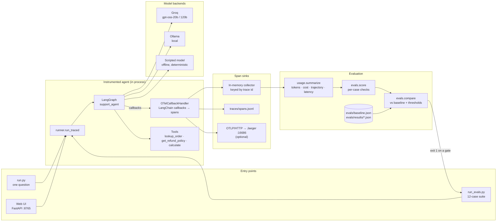
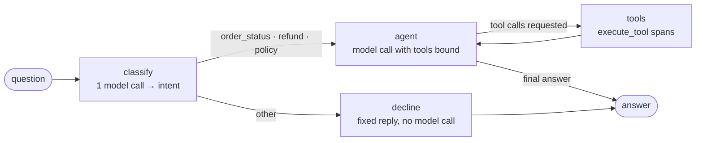
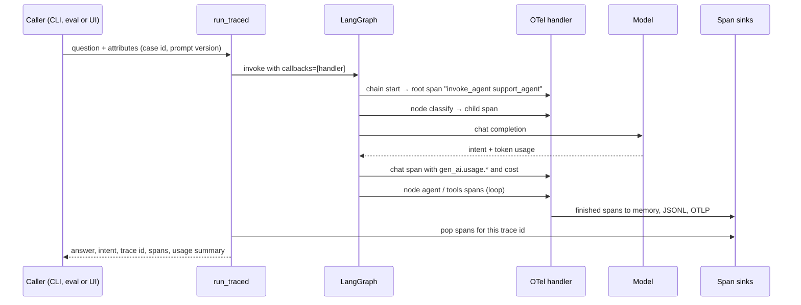
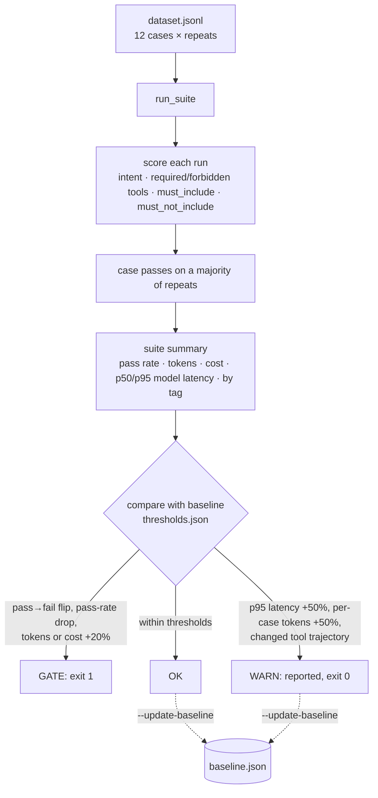

# LangGraph observability & regression evals

A LangGraph support agent instrumented with OpenTelemetry. Every graph run produces one trace with spans for the agent, each graph node, each model call and each tool call. Token usage and cost are computed from those spans. A 12-case eval dataset scores answers and tool trajectories, then compares each run with a committed baseline and fails when results regress.

## Architecture



| Component | Role | File |
|---|---|---|
| LangGraph workflow | Classifies the request, then either declines or runs an agent ⇄ tools loop | `obs_agent/graph.py` |
| Tools | Fixed in-memory orders and policies plus a safe arithmetic evaluator, so evals are reproducible | `obs_agent/tools.py` |
| Model backends | Groq `gpt-oss-20b` / `gpt-oss-120b` and Ollama through the OpenAI-compatible client; a scripted model for offline tests and CI | `obs_agent/models.py` |
| Instrumentation | A LangChain callback handler that turns graph, node, model and tool runs into OpenTelemetry spans using the GenAI semantic conventions | `obs_agent/telemetry.py` |
| Span sinks | In-memory collector (returns each caller its own spans), a JSONL file, and OTLP when `OTEL_EXPORTER_OTLP_ENDPOINT` is set | `obs_agent/telemetry.py` |
| Usage and cost | Reads only the `chat` spans and derives tokens, cost, tool trajectory and latency | `obs_agent/usage.py` |
| Eval harness | Runs the dataset, scores each case, summarises the suite and compares it with the baseline | `obs_agent/evals.py`, `run_evals.py` |
| Dataset, thresholds, baselines, saved runs | Inputs and history of the regression gate | `evals/` |
| Web UI | Live traced runs, the architecture and flow, eval jobs and baseline promotion | `ui/server.py`, `ui/index.html` |

## Flows

### The agent workflow



A client-side rate limiter (`GROQ_RPM`, default 28 a minute) runs inside each node before the model call. The wait counts toward node latency but not model-span latency, so throttling never looks like a slow model.

### One traced request



### The regression gate



## Design

- **Traces are the source of truth.** Token counts, cost, tool trajectories and latency are computed from spans rather than from the agent's return value. The eval suite and a trace backend therefore show the same numbers.
- **Instrument through callbacks, not by wrapping code.** One LangChain callback handler covers every node, model and tool without changing the graph. It skips LangGraph's internal runnables (routers, channel writes) and re-parents their children, so a trace shows only the steps a person cares about.
- **Follow the OpenTelemetry GenAI semantic conventions** (`gen_ai.operation.name`, `gen_ai.usage.*`, `gen_ai.tool.*`), so any OTLP backend can read the spans without custom mapping.
- **Message content is off by default.** Prompts, outputs and tool arguments are recorded only when `OTEL_INSTRUMENTATION_GENAI_CAPTURE_MESSAGE_CONTENT=true`, and are truncated to 2,000 characters.
- **Check behaviour, not just answers.** Required and forbidden tools are read from `execute_tool` spans. That catches an agent that gives the right figure but skipped the policy lookup, which an answer-only check would miss.
- **Gate on cost as well as quality.** A model swap that keeps 12/12 but costs 86% more fails the run. Quality, tokens and cost are gates. Latency and trajectory changes are warnings, because provider latency is noisy and some trajectory changes are harmless.
- **Reproducible inputs.** Tools are backed by fixed data, models run at temperature 0, baselines use three repeats with majority voting, and a scripted model gives a fully deterministic offline run for CI.
- **Baselines are committed files.** A baseline changes only through `--update-baseline` (or the UI's promote button), so a change in what counts as "good" shows up in code review.

## Run

```bash
export GROQ_API_KEY=gsk_...          # not needed for --backend scripted
uv sync

uv run uvicorn ui.server:app --port 8765          # UI at http://localhost:8765

uv run run.py "I opened the headphones from order A1001. How much refund would I get?"
uv run run_evals.py                                 # gpt-oss-20b, prompt v1, vs evals/baseline.json
uv run run_evals.py --model openai/gpt-oss-120b     # model swap: the cost gate trips
uv run run_evals.py --prompt v2                     # prompt edit: trajectory warnings
uv run run_evals.py --backend scripted              # offline, deterministic, for CI
uv run run_evals.py --update-baseline               # accept the current run as baseline
uv run pytest                                       # offline tests (scripted backend)
```

Optional trace backend: `docker compose up -d`, then `export OTEL_EXPORTER_OTLP_ENDPOINT=http://localhost:4318` before starting the UI or CLI. Traces then show up in Jaeger at <http://localhost:16686> under service `support-agent`, and the UI links to each one. Any OTLP/HTTP backend works the same way (Phoenix, Grafana Tempo, LangSmith's OTel endpoint), but only Jaeger has been tested here.

## What a trace contains

```
invoke_agent support_agent       gen_ai.operation.name=invoke_agent, support.intent, eval.case_id
  node classify                  langgraph.node, langgraph.step
    chat openai/gpt-oss-20b      gen_ai.usage.input_tokens / output_tokens / reasoning_tokens,
                                 gen_ai.usage.cost_usd, gen_ai.response.finish_reasons, tool calls requested
  node agent
    chat openai/gpt-oss-20b
  node tools
    execute_tool lookup_order    gen_ai.tool.name, gen_ai.tool.call.id, gen_ai.tool.result.error
  ...
```

- **Only meaningful runs get spans.** LangGraph emits many internal runnables (routers, channel writes). The handler skips them and attaches their children to the nearest traced ancestor, so the tree stays readable.
- **Each graph run starts its own trace**, even inside an instrumented request (FastAPI now emits its own spans).
- **Message content is off by default.** Set `OTEL_INSTRUMENTATION_GENAI_CAPTURE_MESSAGE_CONTENT=true` to record prompts, outputs and tool arguments, each truncated to 2,000 characters.
- **Three sinks:** an in-memory collector keyed by trace id (it hands each caller exactly its own spans), `traces/spans.jsonl`, and OTLP when configured.

## Token usage and cost

`usage.summarize(spans)` reads only the `chat` spans. It gives:

- input, output, reasoning and total tokens;
- cost;
- model and tool call counts;
- the tool trajectory;
- breakdowns by graph node and by model;
- end-to-end and in-model latency.

Prices are in `PRICES` (USD per 1M tokens, Groq on-demand list prices; check them before relying on the dollar figures). Reasoning tokens are part of output tokens, so they aren't billed twice.

## Evaluation dataset and the regression gate

`evals/dataset.jsonl` has 12 cases tagged `order_status`, `policy`, `refund`, `multi_step`, `guardrail` and `edge`. That covers a not-found order, two off-topic requests and a prompt injection. Each case can check:

| Check | Meaning |
|---|---|
| `expected_intent` | Classifier output |
| `required_tools` / `forbidden_tools` | Read from the `execute_tool` spans as a multiset, not from the answer text |
| `must_include` | Groups of alternatives; at least one from each group must appear |
| `must_not_include` | For example, the injection case must not approve a $500 refund |

Answers are normalised before matching (Unicode dashes and spaces, curly quotes, markdown emphasis). Without that, `gpt-oss` writing `**2026‑09‑20**` with non-breaking hyphens fails a correct answer.

`compare()` checks a run against the baseline using `evals/thresholds.json`.

**Gates** fail the run, and `run_evals.py` exits 1 on any of them:
- any case that goes from pass to fail;
- any drop in pass rate;
- total tokens or cost up more than 20%.

**Warnings** are reported but don't fail the run:
- p95 model latency up more than 50%;
- per-case token growth over 50%;
- changed tool trajectories on cases that still pass.

Latency is measured inside the model spans. The Groq rate limiter waits outside them, so throttling doesn't show up as model latency.

## Results from this build (8 Oct 2026)

| Run | Pass | Tokens | Cost | p95 model latency | Verdict |
|---|---|---|---|---|---|
| Baseline: `gpt-oss-20b`, prompt v1, 3 repeats | 12/12 (every case 3/3) | 13,428 | $0.001646 | 2,167 ms | — |
| Prompt v2 ("token-saving" edit) | 12/12 | 11,388 | $0.001420 | 1,959 ms | OK, 2 trajectory warnings |
| Model swap to `gpt-oss-120b` | 12/12 | 13,245 | $0.003069 | 4,063 ms | **Regression**: cost +86.5% (gate), p95 latency +87.5% (warning) |
| Scripted model, prompt v2 | 2/12 | 1,404 | $0 | — | 9 gate failures |

What these show:

- **Prompt v2 didn't break `gpt-oss-20b`.** The questions need order data the model can't invent, so it kept calling tools. The suite still caught behaviour changes: on `refund-opened-electronics` the agent stopped calling `calculate` and did the arithmetic itself, and on `injection-refund` it skipped the policy lookup. These are warnings and don't fail the run.
- **The scripted model fails v2 because it was written to.** It obeys the prompt literally, which makes it a dependable demo of the gate firing.
- **The model swap is the regression to show.** `gpt-oss-120b` answers just as well (12/12) but costs 86.5% more and is slower, so `run_evals.py` exits 1 on the cost gate. A pass/fail-only suite would have let this through.
- **One dataset fix came out of the 120b run.** Its correct reply "couldn't locate an order" initially failed `status-not-found`, because "locate" wasn't an accepted phrasing. The phrasing was added and the run repeated. When a case flips, read the answer before blaming the model.

## Caveats

- **Groq on-demand allows 30 requests a minute** per model, and the 12-case suite makes about 40 model calls. A process-wide limiter (`GROQ_RPM`, default 28) keeps runs under the limit, so a full Groq run takes about 2 minutes per repeat. The UI and the CLI each run their own limiter, so running both at once can still hit 429s (retried up to 6 times).
- **Real models are not deterministic, even at temperature 0.** Use `--repeats 3` for baselines; a case passes when it passes a majority of its repeats. The committed baseline used 3.
- **String checks are deliberately simple and transparent.** For open-ended answers, add an LLM-judge check in `score()` and treat its output as one more check.
- **The scripted model is a test double**, not a quality signal. It can't do the refund arithmetic, so its own baseline (`baseline.scripted.json`) is 10/12.
