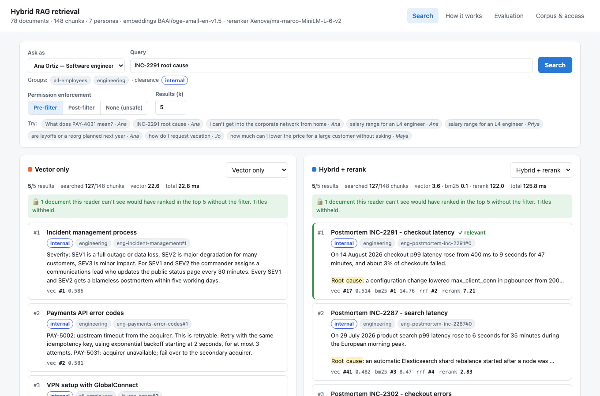
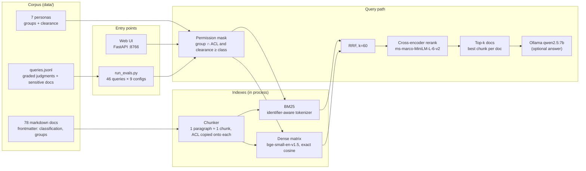
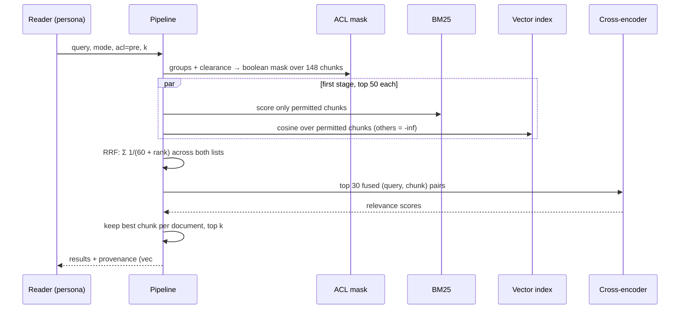
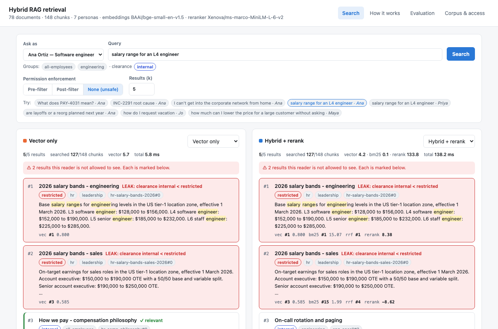
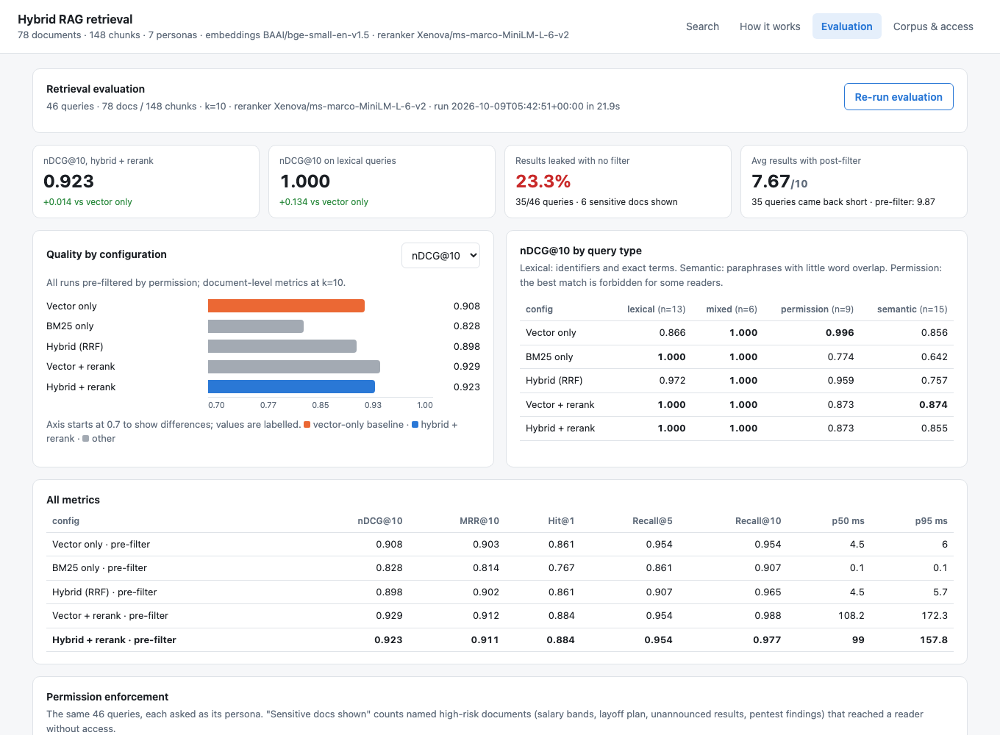

# Permission-aware hybrid RAG retrieval

A retrieval pipeline for enterprise RAG that combines BM25 with dense vector search, fuses the two with reciprocal rank fusion (RRF) and reranks with a cross-encoder. Document permissions (groups and a classification level) are enforced inside both indexes before anything is ranked. A 46-query evaluation set, each query asked as a specific employee, compares this pipeline with vector-only search and compares three ways of enforcing permissions: pre-filter, post-filter and none.

Everything runs locally on CPU. Embeddings and reranking use ONNX models through `fastembed`, so no GPU or API key is needed. The optional answer step uses a local Ollama model.



## Architecture



| Component | Role | File |
|---|---|---|
| Corpus loader and chunker | Parses frontmatter ACLs and splits documents into paragraph chunks (short paragraphs are merged); every chunk carries its document's ACL | `hybrid_rag/corpus.py` |
| Permission model | `can_read` = a shared group **and** clearance ≥ classification; `deny_reason` explains a refusal | `hybrid_rag/acl.py` |
| Lexical retrieval | Okapi BM25 with a tokenizer that keeps `PAY-4031` and `max_client_conn` whole and also indexes their parts | `hybrid_rag/lexical.py` |
| Dense retrieval | `BAAI/bge-small-en-v1.5` (384-d, ONNX), normalised matrix, exact cosine; embeddings cached in `.cache/` | `hybrid_rag/dense.py` |
| Fusion | Reciprocal rank fusion | `hybrid_rag/fusion.py` |
| Reranker | Cross-encoder over the top 30 fused chunks; model set by `RERANK_MODEL` | `hybrid_rag/rerank.py` |
| Pipeline | Five modes (`vector`, `bm25`, `hybrid`, `vector_rerank`, `hybrid_rerank`) × three ACL modes (`pre`, `post`, `none`), with per-stage provenance and timings | `hybrid_rag/pipeline.py` |
| Evaluation | Graded judgments, Hit@1, Recall@5/10, MRR@10, nDCG@10, leak rate, sensitive-document exposure, post-filter starvation | `hybrid_rag/evals.py`, `run_evals.py` |
| Answering | Grounded answer with citations from the permitted chunks only | `hybrid_rag/answer.py` |
| Web UI | Side-by-side search for any persona, pipeline explainer, evaluation dashboard, access matrix | `ui/server.py`, `ui/index.html` |

## The query path



The response also includes `would_surface`: how many documents the reader can't see would have reached the top k without the filter. It is a count only. Returning their titles would itself leak information ("there is a document called *Project Juniper – 2027 workforce plan*").

## Design

- **Filter before ranking, inside every index.** The permission mask is applied to BM25 scores and to the similarity vector before top-k selection. The top k is then the best k *this reader* may see, and forbidden text never reaches the reranker, the prompt or the logs. Post-filtering ranks everything and drops forbidden hits afterwards. It doesn't leak, but readers get short result lists, and the gaps are largest for the least-privileged readers (see results).
- **The ACL lives on the chunk.** Classification and groups are copied onto every chunk at index time, so a query-time filter needs no join against a document store. The cost is re-indexing affected chunks when a document's ACL changes. In production, ACL updates should be propagated as their own event, not only on content changes.
- **Two-part access rule.** A reader needs a shared group *and* enough clearance. Raj is in `finance` but has `confidential` clearance, so the restricted Q3 results stay hidden from him. Groups alone would let him read them.
- **Rank fusion, not score fusion.** BM25 scores (0–20) and cosine similarities (0.4–0.8) aren't comparable, and their distributions vary by query. RRF uses only ranks, so it needs no per-corpus calibration.
- **An identifier-aware tokenizer.** Enterprise queries are full of codes (`PAY-4031`, `HAL-PT-07`, `POL-IT-004`, `gh-ost`). The tokenizer emits both the whole token and its parts, so `PAY-4031` matches exactly and `4031` still matches partially.
- **Rerank a bounded pool.** The cross-encoder sees only the top 30 fused chunks: about 90 ms on CPU, against about 4 ms for the first stage.
- **One chunk per document in the output.** Results collapse to each document's best chunk. Metrics are computed at document level, and the LLM gets five distinct sources rather than three paragraphs of the same page.
- **Exact search on purpose.** At 148 chunks a brute-force matrix product is exact and fast. With an ANN index (HNSW) the same guarantee needs a filter-aware search, such as filtered HNSW in Qdrant, Weaviate or pgvector with iterative scans, or partitions per tenant or classification. Naively filtering ANN results has the same short-list problem as post-filtering.

## Run

```bash
uv sync                                         # Python 3.12–3.13; first run downloads ~110 MB of ONNX models

uv run uvicorn ui.server:app --port 8766         # UI at http://localhost:8766

uv run run_evals.py                              # full comparison, writes results/eval_report.json
uv run run_evals.py --query q35                  # one query's top 5 under every mode
uv run run_evals.py --rerankers Xenova/ms-marco-MiniLM-L-6-v2 BAAI/bge-reranker-base
uv run pytest                                    # 17 offline tests

RERANK_MODEL=BAAI/bge-reranker-base uv run uvicorn ui.server:app --port 8766   # slower, slightly better reranker
```

Answer generation is optional. Run `ollama pull qwen2.5:7b` and keep Ollama running. Set `ANSWER_MODEL` or `OLLAMA_URL` to change the model or host. Search and evaluation don't need Ollama.

### What the UI shows

- **Search**: pick a persona, a query and an enforcement mode. Two columns compare any two modes (vector only vs hybrid + rerank by default). Each result shows its classification and groups, its rank in each stage (`vec #17 · bm25 #1 · rrf #2 · rerank 7.21`) and, for evaluation queries, whether it is judged relevant. With *None (unsafe)*, forbidden results are outlined in red with the reason (`clearance internal < restricted`). With *Post-filter*, the dropped count is shown. *Generate answer* sends the permitted top 5 to the local model.
- **How it works**: the pipeline diagram and the three enforcement strategies.
- **Evaluation**: headline numbers, a per-metric bar chart, nDCG by query type, the permission table, a per-query table of first-relevant ranks (click a row to open it in Search) and the reranker comparison. *Re-run evaluation* runs the suite in the background (about 20 s).
- **Corpus & access**: the documents × personas access matrix, with the reason for each refusal on hover.



## Corpus, personas and judgments

The corpus is synthetic: 78 documents for a fictional company, "Halcyon", across IT, Engineering, Security, HR, Finance, Legal, Sales and Support. It contains 7 public, 59 internal, 7 confidential and 5 restricted documents, split into 148 chunks. It is built to contain what makes enterprise retrieval hard:

- **Near-duplicate identifiers**: three postmortems (`INC-2287`, `INC-2291`, `INC-2302`), three API error-code pages (`PAY-4031`, `BILL-4031`, `ID-4031`).
- **Superseded and retired versions**: the 2024 PTO policy, the retired AnyConnect VPN.
- **Regional and neighbouring policies**: UK annual leave, sick leave, other leave, client entertainment vs travel meals.
- **Restricted documents that answer common questions**: salary bands, the Project Juniper layoff plan, unannounced Q3 results, pentest findings, the commission plan, a litigation hold.

| Persona | Role | Groups | Clearance | Readable docs |
|---|---|---|---|---|
| Ana | Software engineer | all-employees, engineering | internal | 66 |
| Sam | Security engineer | all-employees, engineering, security | confidential | 68 |
| Priya | HR business partner | all-employees, hr | restricted | 45 |
| Raj | Finance analyst | all-employees, finance | confidential | 45 |
| Maya | Account executive | all-employees, sales | confidential | 44 |
| Kim | VP Operations | all-employees, leadership, finance, hr, sales, legal | restricted | 52 |
| Jo | Contractor | contractors | internal | 8 |

`data/queries.jsonl` has 46 queries. Each is asked as one persona, with graded judgments (2 = answers it, 1 = partially) over documents **that persona can read**; `validate()` fails the run otherwise. Queries are tagged:

- **lexical** (13): identifiers and exact terms;
- **semantic** (15): paraphrases with little word overlap;
- **mixed** (6);
- **permission** (12): the obvious match is restricted for some askers. The same question is often asked by a reader with access and one without.

Three permission queries have no answer the asker may read ("are layoffs planned", asked by an engineer). They are excluded from quality averages and count only toward leakage. Nine queries list `sensitive` documents that must never appear for that reader.

## Results from this build (8 Oct 2026)

Full console output: [`results/eval_output.txt`](results/eval_output.txt); full JSON, including per-query rankings: [`results/eval_report.json`](results/eval_report.json). Document-level metrics at k=10, CPU timings on an Apple-silicon laptop.

### Retrieval quality (all pre-filtered)

| Config | Hit@1 | Recall@5 | Recall@10 | MRR@10 | nDCG@10 | p50 latency |
|---|---|---|---|---|---|---|
| Vector only | 0.861 | 0.954 | 0.954 | 0.903 | 0.908 | 4 ms |
| BM25 only | 0.767 | 0.861 | 0.907 | 0.814 | 0.828 | 0.1 ms |
| Hybrid (RRF) | 0.861 | 0.907 | 0.965 | 0.902 | 0.898 | 4 ms |
| Vector + rerank | **0.884** | 0.954 | **0.988** | **0.912** | **0.929** | 108 ms |
| **Hybrid + rerank** | **0.884** | 0.954 | 0.977 | 0.911 | 0.923 | 99 ms |

| nDCG@10 by query type | lexical (13) | mixed (6) | permission (9) | semantic (15) |
|---|---|---|---|---|
| Vector only | 0.866 | 1.000 | **0.996** | 0.856 |
| BM25 only | **1.000** | 1.000 | 0.774 | 0.642 |
| Hybrid (RRF) | 0.972 | 1.000 | 0.959 | 0.757 |
| Vector + rerank | **1.000** | 1.000 | 0.873 | **0.874** |
| Hybrid + rerank | **1.000** | 1.000 | 0.873 | 0.855 |

### Permission enforcement

| Config | Leaked results | Queries with a leak | Sensitive docs shown | Avg results (of 10) | Queries < k | Recall@10 |
|---|---|---|---|---|---|---|
| Vector only, no filter | **23.3%** | 37 / 46 | **6** | 10.0 | 0 | 0.954 |
| Vector only, post-filter | 0% | 0 | 0 | 7.67 | 37 | 0.954 |
| Vector only, pre-filter | 0% | 0 | 0 | 9.87 | 3 | 0.954 |
| Hybrid + rerank, no filter | **23.3%** | 35 / 46 | **6** | 10.0 | 0 | 0.942 |
| Hybrid + rerank, post-filter | 0% | 0 | 0 | 7.67 | 35 | 0.942 |
| Hybrid + rerank, pre-filter | 0% | 0 | 0 | 9.87 | 3 | **0.977** |



What these show:

- **Hybrid retrieval fixes the identifier failures of vector search.** On lexical queries nDCG@10 rises from 0.866 to 1.000. The clearest case is `INC-2291 root cause`. Vector search ranks the general incident process, an API error page and the VPN guide above it, and the right postmortem doesn't reach the top 10: the three incident numbers embed almost identically. BM25 ranks it first, and so does hybrid + rerank. `POL-IT-004` and `gh-ost` move from rank 2 to rank 1.
- **Plain RRF hurts paraphrased queries.** Hybrid without a reranker drops semantic nDCG from 0.856 to 0.757, because BM25 contributes confident wrong candidates for queries like "is my dinner covered when I'm away for work". The cross-encoder recovers this (0.855) while keeping the lexical gains. Ship fusion with a reranker, or weight the vector list higher.
- **Overall, reranking adds more than hybrid does on this set.** Vector + rerank (0.929) and hybrid + rerank (0.923) are close, and both beat vector only (0.908) and hybrid alone (0.898). Most of the identifier problem is fixed by the reranker reading `INC-2291` in the text, as long as the right chunk is in the pool. Hybrid makes sure it is: before reranking, it already reaches recall@10 = 1.0 on lexical queries (vector only: 0.923), and it is the safer choice when identifiers are rarer, chunks longer or the corpus larger.
- **The reranker is the weak spot on some semantic and permission queries.** On "salary range for an L4 engineer" (asked by an engineer), MiniLM-L6 puts the on-call stipend page ("engineers receive an on-call stipend…") above the compensation philosophy, dropping the right answer from rank 1 to 4. For the contractor asking "how do I request vacation", it ranks the public SLA first. This is the main regression against vector only (permission nDCG 0.996 → 0.873), and it comes from the reranker, not the filter.
- **Without enforcement, almost a quarter of what readers see is off-limits.** 37 of 46 queries return at least one document the reader can't open. Six named high-risk documents reach readers without access: 2026 salary bands to an engineer, the Project Juniper layoff plan to an engineer, unannounced Q3 results to a finance analyst without clearance, pentest findings, the commission plan, and the PTO policy to a contractor. Hybrid search doesn't change this: a better retriever finds restricted documents more reliably, not less.
- **Post-filtering is safe but returns short lists.** It returns 7.7 results on average instead of 10, and 35–37 of 46 queries come back short. Jo, the contractor, gets 1, 2 and 0 results for their three queries; "how do I request vacation" returns nothing at all, because forbidden documents (the PTO policies and other internal HR pages) filled all ten slots before the filter ran. With hybrid + rerank, pre-filtering also lifts recall@10 from 0.942 to 0.977, because the 30 rerank slots go to permitted candidates only.
- **Pre-filtering costs nothing.** Building the mask takes about 30 µs. Only 3 queries return fewer than 10 results, all from Jo, who can read only 8 documents.

### Reranker comparison

| Cross-encoder | First stage | Hit@1 | MRR@10 | nDCG@10 | Semantic nDCG | p50 |
|---|---|---|---|---|---|---|
| `Xenova/ms-marco-MiniLM-L-6-v2` (default) | hybrid | 0.884 | 0.911 | 0.923 | 0.855 | 96 ms |
| `Xenova/ms-marco-MiniLM-L-12-v2` | hybrid | 0.884 | 0.910 | 0.920 | 0.855 | 180 ms |
| `jinaai/jina-reranker-v1-turbo-en` | hybrid | 0.814 | 0.873 | 0.894 | 0.758 | 117 ms |
| `BAAI/bge-reranker-base` | hybrid | **0.907** | **0.941** | **0.931** | **0.860** | 503 ms |
| `BAAI/bge-reranker-base` | vector | **0.907** | **0.941** | **0.943** | **0.894** | 515 ms |

`bge-reranker-base` is the most accurate, at about five times the latency. MiniLM-L6 stays the default because the demo should feel instant. Switch with `RERANK_MODEL`. Full rows are in [`results/reranker_comparison.json`](results/reranker_comparison.json).

## Caveats

- **The set is small and was built with the system.** It has 46 queries and 78 documents, and the hard negatives were written to resemble real enterprise corpora. One query is worth about 2 points of hit@1, so differences under about 0.02 nDCG are noise. The reranker default was chosen on this same set, and there is no held-out split. Treat the numbers as a demonstration of the effects, and build a judgment set from real logs before choosing a configuration.
- **"Leaked results" counts every forbidden document in the top 10**, including ones that are merely nearby, so the 23% partly reflects how small the permitted corpus is for some readers. "Sensitive docs shown" is the sharper measure: named documents that answer the question and must not reach that reader.
- **Exact vector search.** See *Design*: with an ANN index, use the store's filter-aware search, or the guarantees above don't carry over.
- **The ACL model is static.** Group and clearance data come from a JSON file. In production they come from the identity provider at query time (for example, groups in the OIDC token) and from the source system's ACLs at ingest. Both must be kept in sync: a revoked group membership has to take effect on the next query, not the next re-index.
- **Retrieval is not the only leak path.** Caches, query logs, analytics on prompts and "related documents" features all need the same filter. The answer step here only ever receives filtered chunks.
- **Chunking is paragraph-based** and suits these short documents. Long documents need section-aware chunking and probably a parent-document step.
